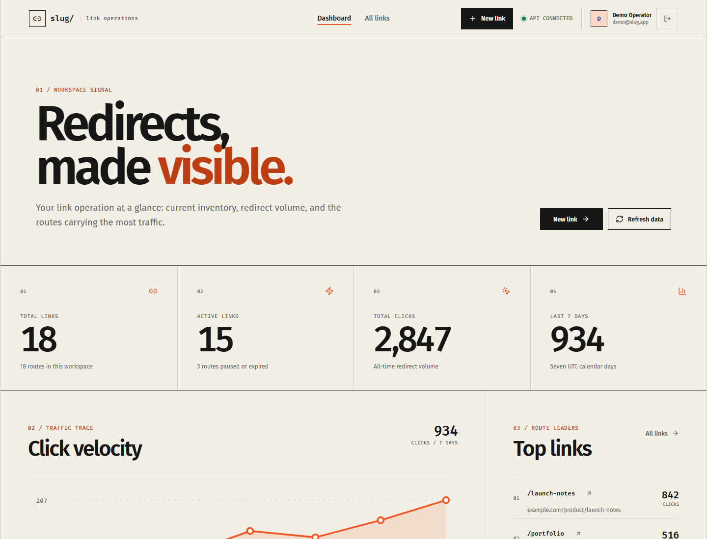
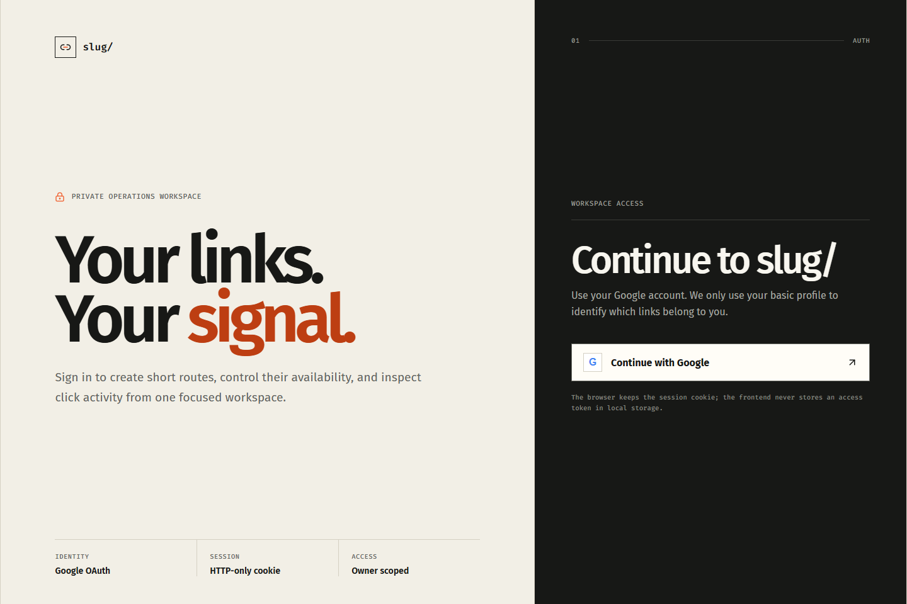

# slug/ — production-minded URL shortener

A full-stack URL shortener focused on backend fundamentals: redirect
correctness, owner-scoped link management, Redis caching, rate limiting,
analytics, OAuth, and multi-service deployment.

[Live application](https://app.slgs.dpdns.org) ·
[API health](https://slgs.dpdns.org/api/health) ·
[Repository](https://github.com/nguyen279166/url-shortener)

Dashboard preview uses demo data so no real account information is published.

Google OAuth sign-in screen

## What it demonstrates

- Google OAuth with Better Auth and HTTP-only session cookies.
- Owner-scoped CRUD for short links, including custom aliases, expiration,
  pause/reactivate, search, pagination, and soft deletion.
- Public HTTP 302 redirects with 404/410 lifecycle handling.
- Cache-aside Redis reads with PostgreSQL fallback and targeted invalidation.
- Redis-backed fixed-window rate limiting per authenticated user for link
  creation.
- Click analytics with referrer, user-agent, timestamps, and hashed IP values.
- A per-user dashboard with seven-day traffic, top links, and recent links.
- Dockerized API builds, production migrations, health checks, and GitHub
  Actions quality gates.
- Deployment across Vercel, Render, Neon, Upstash, and Cloudflare-managed DNS.

## Production architecture

~~~mermaid
flowchart LR
  User["Browser"] --> Web["app.slgs.dpdns.org React on Vercel"]
  Web -->|"/api/* same-origin rewrite"| API["Express API on Render"]
  User -->|"slgs.dpdns.org/:slug"| API
  API --> Auth["Google OAuth Better Auth"]
  API --> DB["Neon PostgreSQL Prisma"]
  API --> Redis["Upstash Redis cache + rate limit"]
  API -->|"HTTP 302"| Target["Original URL"]
~~~

The frontend proxies <code>/api/*</code> through Vercel. From the browser's
perspective, authentication and API requests remain same-origin, which avoids
cross-site cookie problems. Public short links go directly to Render so the
redirect path does not pay for an extra Vercel hop.

## Redirect flow

~~~text
GET /:slug
  -> check Redis for a cached redirect target
  -> query PostgreSQL on a cache miss
  -> return 404 when the slug does not exist
  -> return 410 when it is paused, expired, or deleted
  -> record a click event
  -> respond with HTTP 302 and Cache-Control: no-store
~~~

Redis is an optimization, not a hard dependency. If Redis is unavailable,
redirects fall back to PostgreSQL. The custom create-link rate limiter also
fails open so a Redis outage does not make the application unavailable.

## Tech stack

| Layer | Technology |
| --- | --- |
| Monorepo | pnpm workspaces |
| Frontend | React 19, Vite 8, TypeScript, React Router, Lucide |
| Backend | Node.js 22, Express 5, TypeScript, Zod |
| Authentication | Better Auth, Google OAuth, Prisma adapter |
| Database | PostgreSQL, Prisma 7 |
| Cache and rate limit | Redis / Upstash |
| Testing | Vitest, Supertest |
| Infrastructure | Docker, Docker Compose, GitHub Actions |
| Hosting | Vercel, Render, Neon, Upstash, Cloudflare DNS |

## API

All management endpoints are owner-scoped and require a valid session cookie.

| Method | Path | Authentication | Purpose |
| --- | --- | --- | --- |
| GET | <code>/api/health</code> | Public | API liveness and deployed revision |
| ALL | <code>/api/google-callback/auth/*</code> | Public | Better Auth handlers |
| GET | <code>/:slug</code> | Public | Resolve and record a redirect |
| GET | <code>/api/dashboard</code> | Required | Per-user dashboard metrics |
| GET | <code>/api/links</code> | Required | Search and paginate owned links |
| POST | <code>/api/links</code> | Required | Create a link or custom alias |
| GET | <code>/api/links/:slug</code> | Required | Get one owned link |
| PATCH | <code>/api/links/:slug</code> | Required | Pause/reactivate or change expiration |
| DELETE | <code>/api/links/:slug</code> | Required | Soft-delete an owned link |
| GET | <code>/api/links/:slug/stats</code> | Required | Click totals and recent events |

## Local development

### Requirements

- Node.js 22+
- pnpm 10.20+
- Docker Desktop
- A Google OAuth web client

### Google OAuth for local development

Configure the Google OAuth client with:

~~~text
Authorized JavaScript origin:
http://localhost:5173

Authorized redirect URI:
http://localhost:3000/api/google-callback/auth/callback/google
~~~

### Start the application

~~~powershell
pnpm install

Copy-Item apps/api/.env.example apps/api/.env
Copy-Item apps/web/.env.example apps/web/.env

pnpm db:start
pnpm db:migrate
pnpm dev
~~~

Then open:

- Frontend: http://localhost:5173
- API health: http://localhost:3000/api/health

Stop the local databases without deleting their volumes:

~~~powershell
pnpm db:stop
~~~

## Environment variables

### API — apps/api/.env

| Variable | Required | Description |
| --- | --- | --- |
| <code>DATABASE_URL</code> | Yes | PostgreSQL connection string |
| <code>REDIS_URL</code> | No | Redis TCP/TLS URL; PostgreSQL fallback is used when absent |
| <code>WEB_ORIGIN</code> | Yes | Browser origin allowed by CORS and Better Auth |
| <code>BETTER_AUTH_URL</code> | Yes | Public origin that exposes the Better Auth routes |
| <code>BETTER_AUTH_SECRET</code> | Production | Random secret with at least 32 characters |
| <code>GOOGLE_CLIENT_ID</code> | Production | Google OAuth client ID |
| <code>GOOGLE_CLIENT_SECRET</code> | Production | Google OAuth client secret |
| <code>CREATE_LINK_RATE_LIMIT</code> | No | Create-link requests allowed per window; default 10 |
| <code>RATE_LIMIT_WINDOW_SECONDS</code> | No | Rate-limit window; default 60 seconds |
| <code>TRUST_PROXY_HOPS</code> | No | Express trusted proxy hops; default 1 |
| <code>PORT</code> | No | API port; default 3000 |

### Frontend — apps/web/.env

| Variable | Usage |
| --- | --- |
| <code>VITE_API_URL</code> | Development API origin |
| <code>VITE_SHORT_BASE_URL</code> | Public domain used when displaying and copying short URLs |

Vite variables are embedded at build time. Changing one in Vercel requires a
new frontend deployment.

## Production configuration

The current deployment uses:

~~~text
Frontend:
https://app.slgs.dpdns.org

Short-link/API domain:
https://slgs.dpdns.org
~~~

Important production values:

~~~dotenv
# Render API
WEB_ORIGIN=https://app.slgs.dpdns.org
BETTER_AUTH_URL=https://app.slgs.dpdns.org

# Vercel frontend
VITE_SHORT_BASE_URL=https://slgs.dpdns.org
~~~

The production Google OAuth client uses:

~~~text
Authorized JavaScript origin:
https://app.slgs.dpdns.org

Authorized redirect URI:
https://app.slgs.dpdns.org/api/google-callback/auth/callback/google
~~~

Secrets remain in Render/Vercel environment settings and are never committed.
The Vercel rewrite target remains the Render service URL; Cloudflare DNS maps
the public custom domains to Vercel and Render.

## Docker

Start only PostgreSQL and Redis for normal local development:

~~~powershell
pnpm db:start
~~~

Build and run the API, PostgreSQL, and Redis together:

~~~powershell
pnpm stack:start
pnpm stack:logs
pnpm stack:stop
~~~

The API image is multi-stage, runs as a non-root user, includes a health check,
and applies committed Prisma migrations before starting.

## Quality checks

~~~powershell
pnpm lint
pnpm typecheck
pnpm test
pnpm build
pnpm docker:build
~~~

GitHub Actions runs migrations against PostgreSQL, linting, type-checking,
40 backend tests, production builds, and a Docker image build for every push
and pull request targeting <code>main</code>.

## Project structure

~~~text
apps/
  api/
    prisma/              database schema and migrations
    src/
      controllers/       HTTP request and response handling
      middleware/        auth, error handling, rate limiting
      routes/            endpoint composition
      services/          business logic and data access
      validation/        Zod request schemas
  web/
    src/
      components/        reusable UI and dashboard components
      pages/             routed screens
      lib/               API and Better Auth clients
docs/
  screenshots/           README-safe demo captures
.github/workflows/       CI pipeline
compose.yaml              local PostgreSQL, Redis, and API stack
Dockerfile                production API image
~~~

## Design decisions and trade-offs

- **302 instead of 301:** destinations, pause state, and expiration remain
  controllable after a link is shared.
- **No-store redirects:** browser/CDN caches cannot hide a pause, deletion, or
  destination change.
- **Cache-aside Redis:** hot redirects avoid repeated database reads while
  PostgreSQL remains the source of truth.
- **Targeted invalidation:** update, pause, expiration changes, and deletion
  remove the corresponding cached redirect.
- **Soft deletion:** deleted aliases stay reserved, preventing an old trusted
  URL from later pointing to another owner's destination.
- **Owner-scoped management:** users only manage and inspect their own links;
  redirect resolution stays public.
- **Pseudonymized analytics:** raw client IPs are not stored; a SHA-256 value is
  recorded for the click event.
- **Synchronous click writes:** analytics are consistent before redirecting,
  at the cost of one database write on the redirect path.
- **Same-origin API proxy:** OAuth cookies remain first-party, while the public
  redirect avoids the proxy for lower latency.
- **User-scoped creation limit:** authenticated link creation is limited by
  user ID rather than a caller-controlled forwarded-IP value.

## Current limitations

- The Render free service can cold-start after inactivity.
- Redis-backed link creation rate limiting fails open during Redis outages.
- Click recording is synchronous; a queue would be the next scaling step, not
  a requirement for this portfolio scope.
- Frontend browser/E2E tests are not included yet; backend behavior is covered
  with Vitest and Supertest.
- The Render fallback hostname is still publicly reachable. Platform IP
  headers improve analytics attribution, but strict origin authentication
  would be the next hardening step for a higher-risk production service.
